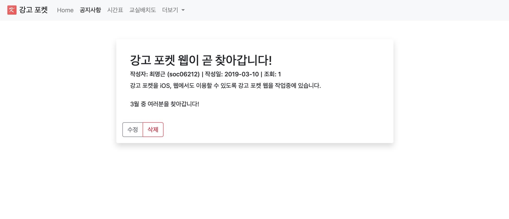

> 런칭 당시 공지사항 Preview

강고 포켓 Web은 강원고등학교 학생들과 선생님의 소통 창구입니다. 

 

# 강고 포켓 웹

> 강원고등학교 학생들을 위해 5년간 힘써왔던 강고 포켓 시리즈의 모든 서비스가 2020년 12월 02일부로 종료되었습니다.
>  강고 포켓은 안드로이드 버전을 시작으로 iOS 버전, Web 버전을 차례로 출시하며 복잡한 학교 시스템 속 보탬이 되기 위해 노력했습니다.
>  개발자의 졸업과 입대, 두 번의 고비를 넘겨 많은 분들의 도움과 지지를 받았음에도 서버와 애플리케이션의 유지가 힘들다는 판단에 따른 결정입니다.
>  강고 포켓의 여정은 끝이 났지만, 이후 제 2의 강고 포켓이 탄생하길 기대하며 여태까지 만들었던 소스를 모두 공개하려고 합니다.
>  - [강고 포켓 안드로이드](https://github.com/soc06212/kanggo-pocket-android)
>  - [강고 포켓 iOS](https://github.com/soc06212/kanggo-pocket-ios)
>  - **[강고 포켓 Web](https://github.com/soc06212/kanggo-pocket-web)**
>  강고 포켓 안드로이드/ iOS는 개인정보를 기기 내에서 저장하고 처리하기 때문에 앱을 삭제하면 저장된 정보가 삭제됩니다.
>  강고 포켓 Web은 2020년 12월 01일 18시 30분, 서버가 종료됨과 함께 영구적으로 삭제되었습니다.
>  개인정보처리방침에 대한 자세한 정보는 [강고 포켓 개인정보 처리방침](https://ridsoft.xyz/privacy/basic_policy.html)을 참고해 주시기 바라며, 기타 문의는 [홈페이지](https://ridsoft.xyz)를 통해 하실 수 있습니다.

 

## 기능

1. 시간표
    > 모든 학급의 시간표를 확인할 수 있습니다.

2. 공지사항
    > 각 학년 및 학급의 공지사항을 확인할 수 있습니다.
    >  선생님께서 작성한 공지사항을 강고 포켓 웹 또는 모바일 애플리케이션에서 간단하게 확인할 수 있습니다.

3. 기타 기능
    > 이 외에도 교실 배치도, 생활 일과표, 학교 정보 등 유용한 정보를 제공하는 기능도 탑재되어 있습니다.

 

## 개발 사양
* 개발 언어: Java
* 웹 프레임워크: JSP
* DBMS: MariaDB
* 시간표: Google SpreadSheet
